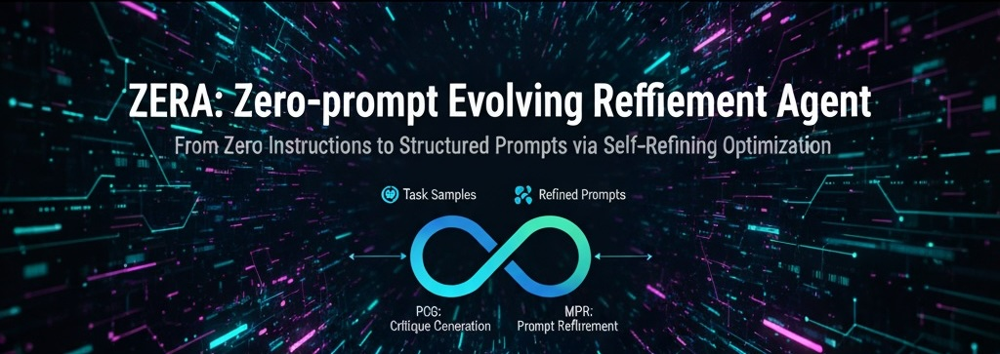

<div align="center">
  
</div>

# Zera Agent (Prompt Auto Tuning Agent)

## Overview

**Zera Agent** is a prompt auto-tuning agent that automatically optimizes, evaluates, and iteratively improves prompts across various LLMs (Large Language Models).  
This agent is designed to systematically evaluate prompt quality, utilize meta-prompts to generate better prompts, and conduct iterative experiments across various datasets and models.

---

## 📄 About the Paper

This project is based on our research paper:

**ZERA: Zero-prompt Evolving Refinement Agent – From Zero Instructions to Structured Prompts via Principle-based Optimization**  
✅ Accepted to **EMNLP 2025 Main Conference (Main Track)**

### Research Contribution
- **Joint Optimization**: Unlike prior APO (Automatic Prompt Optimization) methods that only refine user prompts, ZERA jointly optimizes both **system and user prompts**.
- **Principle-based Evaluation**: Introduces eight general evaluation principles (Correctness, Reasoning Quality, Conciseness, etc.) with adaptive weighting to guide prompt refinement.
- **Self-Refining Framework**: Iterative loop of **PCG (Principle-based Critique Generation)** and **MPR (Meta-cognitive Prompt Refinement)** enables evolution from minimal “zero” prompts to structured, task-optimized prompts.
- **Efficiency**: Achieves high-quality prompts with only **5–20 samples** and short iteration cycles.

### Results
- Benchmarked across **5 LLMs** (GPT-3.5, GPT-4o, LLaMA-3.1, Qwen-2.5, Mistral-7B) and **9 datasets** (MMLU, GSM8K, BBH, CNN/DailyMail, SAMSum, MBPP, HumanEval, etc.).
- Consistently outperforms recent APO methods (**PromptAgent, OPRO, CriSPO**) on reasoning, summarization, and code generation tasks.
- Demonstrates strong **generalization** and **rapid convergence**, even without handcrafted prompts or task descriptions.

📎 [Read the Full Paper (EMNLP 2025)](TBD)

---


### 🚀 **Core Concept: Self-Refining Optimization**

Zera Agent implements a unique **Self-Refining Optimization** process that continuously evolves prompts from zero instructions to structured, high-performance prompts:

- **🔄 PCG (Prompt Critique Generation)**: Automatically generates critiques of current prompt performance
- **⚡ MPR (Meta Prompt Refinement)**: Uses meta-prompts to refine and improve prompts iteratively
- **♾️ Infinity Loop**: Continuous refinement cycle for optimal prompt evolution

This approach enables the agent to start with minimal instructions and progressively develop sophisticated, task-specific prompts through automated self-improvement.

---

## Directory Structure and Roles

```
agent/
  app/           # Streamlit-based web UI and state management
  common/        # Common utilities including API clients
  core/          # Core logic for prompt tuning and iteration result management
  dataset/       # Various benchmark datasets and data loaders
  prompts/       # System/user/meta prompt templates
  test/          # Unit test code
  __init__.py    # Package initialization

evaluation/
  base/                # Common base for evaluation system and execution scripts
  dataset_evaluator/   # Dataset-specific evaluators (LLM-based)
    bert/              # BERTScore-based prompt comparison
    llm_judge/         # LLM Judge-based comparison results
  llm_judge/           # LLM Judge evaluation result CSVs
  examples/            # Evaluation and tuning example code
  results/             # Evaluation result storage
  samples/             # Sample data

scripts/               # Command-line interface tools and utilities
  run_prompt_tuning.py      # CLI for prompt tuning experiments
  run_batch_experiments.py  # Batch experiment execution
  update_results.py         # Result update utilities
  run_background.sh         # Background process management
```

### agent directory
- **app/**: Streamlit-based web interface and state management
- **common/**: Common client for communicating with various LLM APIs
- **core/**: Core logic for prompt auto-tuning and iteration result management
- **dataset/**: Various benchmark dataset loaders and data folders
- **prompts/**: System/user/meta/evaluation prompt templates
- **test/**: Prompt tuner test code

### evaluation directory
- **base/**: Common base classes for evaluation system (`BaseEvaluator`) and execution scripts (`main.py`)
- **dataset_evaluator/**: LLM evaluators for each dataset (e.g., `gsm8k_evaluator.py`, `mmlu_evaluator.py`, etc.)
  - **bert/**: Prompt comparison using BERTScore and results (`bert_compare_prompts.py`, `zera_score.json`, `base_score.json`, etc.)
  - **llm_judge/**: LLM Judge-based comparison result storage
- **llm_judge/**: Comparison result CSVs generated by LLM Judge
- **examples/**: Dataset-specific evaluation/tuning example code and execution methods
- **results/**: Evaluation result storage folder
- **samples/**: Sample data

---

## Key Features

- **Prompt Auto-tuning**:  
  - Iteratively improve system/user prompts to maximize LLM performance
  - Utilize meta-prompts to guide LLMs to directly improve prompts themselves

- **Support for Various Models and Datasets**:  
  - Support for various models including OpenAI GPT, Anthropic Claude, Upstage Solar, local LLMs
  - Built-in benchmark datasets including MMLU, GSM8K, CNN, MBPP, TruthfulQA

- **Automated Output Evaluation**:  
  - Automatically evaluate LLM outputs using 8 evaluation criteria (accuracy, completeness, expression, reliability, conciseness, correctness, structural consistency, reasoning quality)
  - Improve prompts based on evaluation results

- **Various Evaluation Methods**:
  - **LLM-based Evaluation**: LLMs directly perform correctness assessment, scoring, and detailed evaluation for each dataset
  - **BERTScore-based Evaluation**: Compare output similarity (F1, Precision, Recall, etc.) between prompts using BERT embeddings
  - **LLM Judge-based Evaluation**: LLMs directly compare outputs from two prompts to determine winner/loser and reasons

- **Web UI**:  
  - Intuitive experiment management and result visualization based on Streamlit

---

## Evaluation System Usage

### 1. LLM Evaluation Execution

You can execute LLM evaluation with various datasets and prompts through `evaluation/base/main.py`.

```bash
python evaluation/base/main.py --dataset <dataset_name> --model <model_name> --model_version <version> \
  --base_system_prompt <existing_system_prompt> --base_user_prompt <existing_user_prompt> \
  --zera_system_prompt <zera_system_prompt> --zera_user_prompt <zera_user_prompt> \
  --num_samples <sample_count>
```

- Evaluation results are stored in `evaluation/results/`.
- You can compare prompt performance using various metrics like accuracy, ROUGE, etc.

### 2. BERTScore-based Prompt Comparison

Running `evaluation/dataset_evaluator/bert/bert_compare_prompts.py` allows you to compare ZERA prompt and existing prompt outputs using BERTScore.

```bash
python evaluation/dataset_evaluator/bert/bert_compare_prompts.py
```

- Results are saved as `comparison_results.csv`.

### 3. LLM Judge-based Comparison

You can check results where LLMs directly compare outputs from two prompts (winner, reasons, etc.) in `evaluation/llm_judge/comparison_results.csv`.

### 4. Example Execution

The `evaluation/examples/` directory contains example code for each dataset.

```bash
python evaluation/examples/<dataset>_example.py
```

- Requires `requirements.txt` installation and `.env` environment variable setup before running examples

---

## Quick Start

Get up and running with Zera Agent in minutes:

### 1. Clone and Setup
```bash
git clone https://github.com/your-repo/zera-agent.git
cd zera-agent
pip install -r requirements.txt
```

### 2. Configure API Keys
Create a `.env` file in the project root with your API keys:

```bash
# Required API Keys
OPENAI_API_KEY=your_openai_api_key_here
ANTHROPIC_API_KEY=your_anthropic_api_key_here
SOLAR_API_KEY=your_solar_api_key_here
SOLAR_STRAWBERRY_API_KEY=your_solar_strawberry_api_key_here

# Optional: Local model configuration
LOCAL_MODEL_ENDPOINT=http://localhost:8000/v1
LOCAL_MODEL_API_KEY=your_local_api_key_here

# Optional: Slack notifications
SLACK_WEBHOOK_URL=your_slack_webhook_url_here
SLACK_CHANNEL=#experiments
```

**Note**: You only need to set the API keys for the models you plan to use.

### 3. Run Your First Experiment
```bash
# Quick test with BBH dataset
python scripts/run_prompt_tuning.py \
  --dataset bbh \
  --total_samples 10 \
  --iterations 3 \
  --model solar
```

### 4. Explore with Web UI
```bash
streamlit run agent/app/streamlit_app.py
```

## Installation and Execution

1. Install dependencies
   ```
   pip install -r requirements.txt
   ```

2. Set environment variables  
   Enter OpenAI, Anthropic, etc. API keys in `.env` file

3. Run web UI
   ```
   streamlit run agent/app/streamlit_app.py
   ```

4. Run CLI tools (optional)
   ```bash
   # Run prompt tuning experiment
   python scripts/run_prompt_tuning.py --dataset bbh --total_samples 20 --iterations 5 --model solar
   
   # Run batch experiments
   python scripts/run_batch_experiments.py --config experiments_config.json
   
   # Update results
   python scripts/update_results.py
   ```

---

## Usage Examples

- Automatically generate optimal prompts for new tasks
- Automate LLM benchmark experiments and result comparison
- Prompt engineering research and experiments
- Quantitative/qualitative prompt performance comparison using various evaluation methods (LLM, BERT, LLM Judge)

---

## Troubleshooting

### Common Issues

#### 🔑 **API Key Errors**
```bash
Error: No API key found for model 'solar'
```
**Solution**: Ensure your `.env` file contains the correct API key for the model you're using.

#### 📦 **Import Errors**
```bash
ModuleNotFoundError: No module named 'agent'
```
**Solution**: Make sure you're running commands from the project root directory, not from subdirectories.

#### 💾 **Memory Issues**
```bash
MemoryError: Unable to allocate array
```
**Solution**: Reduce the `--total_samples` or `--iteration_samples` parameters.

#### ⏱️ **Timeout Errors**
```bash
RequestTimeout: Request timed out
```
**Solution**: Check your internet connection and API rate limits.

#### 📊 **Evaluation Errors**
```bash
EvaluationError: Failed to evaluate response
```
**Solution**: Verify your evaluation prompts are properly formatted and the model can access them.

### Getting Help

- **GitHub Issues**: [Report bugs and request features](https://github.com/your-repo/zera-agent/issues)
- **Discussions**: [Join community discussions](https://github.com/your-repo/zera-agent/discussions)
- **Documentation**: Check the [scripts/README.md](scripts/README.md) for CLI usage details

## Contributing and Inquiries

- Pull Requests and Issues welcome
- Inquiries: Please use [GitHub Issues](https://github.com/your-repo/zera-agent/issues) for questions and bug reports

## License

This project is licensed under the MIT License - see the [LICENSE](LICENSE) file for details.

---

This README is written based on the actual code structure, key features, and the entire evaluation system.  
If you have additional questions or need detailed explanations, please let me know! 