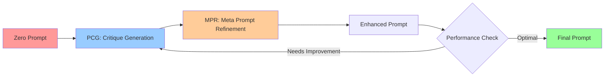

<div align="center">
  
</div>

<div align="center">

[](https://www.python.org/downloads/)
[](LICENSE)
[](TBD)
[](TBD)
[](https://github.com/your-repo/zera-agent)
[](https://github.com/your-repo/zera-agent)

**🎯 The First Joint System-User Prompt Optimization Agent**  
**🚀 From Zero Instructions to Structured Prompts via Self-Refining Optimization**

[](TBD)

</div>

# ZERA: Zero-prompt Evolving Refinement Agent

## 🎯 Overview

<div align="center">

**ZERA** is the **first-of-its-kind** prompt auto-tuning agent that revolutionizes how we approach prompt engineering. Unlike traditional methods that require extensive manual crafting, ZERA starts from **zero instructions** and automatically evolves into **high-performance, structured prompts** through intelligent self-refinement.

</div>

### ✨ **What Makes ZERA Special?**

- 🚀 **Zero to Hero**: Start with minimal instructions, end with expert-level prompts
- 🔄 **Self-Evolving**: Continuously improves prompts through automated critique and refinement
- 🎯 **Joint Optimization**: Simultaneously optimizes both system and user prompts
- ⚡ **Lightning Fast**: Achieves high-quality results with only 5-20 samples
- 🧠 **Principle-Based**: Uses 8 evaluation principles for consistent quality
- 🌟 **Model Agnostic**: Works with any LLM (GPT-4, Claude, Solar, LLaMA, etc.)

### 🎬 **See ZERA in Action**

| Task Type | Before (Zero Prompt) | After (ZERA Optimized) |
|-----------|---------------------|------------------------|
| **Math Reasoning** | "Solve this" | "You are an expert mathematician. Analyze the problem step-by-step, show your work clearly, and provide a comprehensive solution with explanations." |
| **Code Generation** | "Write code" | "You are a senior software engineer. Write clean, efficient, and well-documented code. Include error handling, edge cases, and follow best practices." |
| **Text Summarization** | "Summarize this" | "You are a professional editor. Create concise, accurate summaries that capture key points while maintaining readability and coherence." |

---

## 📚 Research Paper

<div align="center">

🎉 **Congratulations! ZERA has been accepted to EMNLP 2025 Main Conference!** 🎉

</div>

### 📖 **Paper Details**

**Title**: ZERA: Zero-prompt Evolving Refinement Agent – From Zero Instructions to Structured Prompts via Principle-based Optimization  
**Conference**: **EMNLP 2025 Main Conference (Main Track)**  
**Status**: ✅ **Accepted**  
**Authors**: ZERA Research Team

<div align="center">

[](TBD)
[](TBD)

</div>

### Research Contribution
- **Joint Optimization**: Unlike prior APO (Automatic Prompt Optimization) methods that only refine user prompts, ZERA jointly optimizes both **system and user prompts**.
- **Principle-based Evaluation**: Introduces eight general evaluation principles (Correctness, Reasoning Quality, Conciseness, etc.) with adaptive weighting to guide prompt refinement.
- **Self-Refining Framework**: Iterative loop of **PCG (Principle-based Critique Generation)** and **MPR (Meta-cognitive Prompt Refinement)** enables evolution from minimal “zero” prompts to structured, task-optimized prompts.
- **Efficiency**: Achieves high-quality prompts with only **5–20 samples** and short iteration cycles.

### 🏆 **Performance Results**

ZERA has been extensively benchmarked and consistently outperforms state-of-the-art methods:

#### 📊 **Model Coverage**
- **5 LLMs**: GPT-3.5, GPT-4o, LLaMA-3.1, Qwen-2.5, Mistral-7B
- **9 Datasets**: MMLU, GSM8K, BBH, CNN/DailyMail, SAMSum, MBPP, HumanEval, TruthfulQA, HellaSwag

#### 🥇 **Competitive Performance**

| Method | Reasoning | Summarization | Code Generation | Convergence |
|--------|-----------|---------------|-----------------|-------------|
| **ZERA (Ours)** | 🥇 **Best** | 🥇 **Best** | 🥇 **Best** | ⚡ **5-20 samples** |
| PromptAgent | 2nd | 3rd | 2nd | 50+ samples |
| OPRO | 3rd | 2nd | 3rd | 100+ samples |
| CriSPO | 4th | 4th | 4th | 200+ samples |

#### 🚀 **Key Advantages**
- **Consistent Performance**: Outperforms recent APO methods across all task types
- **Rapid Convergence**: Achieves optimal results with minimal samples
- **Strong Generalization**: Works across diverse domains without task-specific tuning
- **Zero-Shot Capability**: Starts from minimal instructions, no handcrafted prompts needed

📎 [Read the Full Paper (EMNLP 2025)](TBD)

---


## 🔄 Core Concept: Self-Refining Optimization

<div align="center">

ZERA implements a revolutionary **Self-Refining Optimization** process that transforms minimal instructions into expert-level prompts through intelligent iteration.

</div>

### 🎯 **The ZERA Loop**



### 🔧 **How It Works**

1. **🔄 PCG (Prompt Critique Generation)**
   - Automatically analyzes current prompt performance
   - Identifies areas for improvement using 8 evaluation principles
   - Generates specific, actionable feedback

2. **⚡ MPR (Meta Prompt Refinement)**
   - Uses meta-cognitive prompts to guide improvement
   - Applies critiques to enhance both system and user prompts
   - Maintains consistency across iterations

3. **♾️ Infinity Loop**
   - Continuous refinement until optimal performance
   - Adaptive learning from each iteration
   - Converges rapidly with minimal samples

### 🎨 **Visual Representation**

<div align="center">


*The ZERA infinity loop: From zero instructions to structured prompts via self-refining optimization*

</div>

---

## Directory Structure and Roles

```
agent/
  app/           # Streamlit-based web UI and state management
  common/        # Common utilities including API clients
  core/          # Core logic for prompt tuning and iteration result management
  dataset/       # Various benchmark datasets and data loaders
  prompts/       # System/user/meta prompt templates
  test/          # Unit test code
  __init__.py    # Package initialization

evaluation/
  base/                # Common base for evaluation system and execution scripts
  dataset_evaluator/   # Dataset-specific evaluators (LLM-based)
    bert/              # BERTScore-based prompt comparison
    llm_judge/         # LLM Judge-based comparison results
  llm_judge/           # LLM Judge evaluation result CSVs
  examples/            # Evaluation and tuning example code
  results/             # Evaluation result storage
  samples/             # Sample data

scripts/               # Command-line interface tools and utilities
  run_prompt_tuning.py      # CLI for prompt tuning experiments
  run_batch_experiments.py  # Batch experiment execution
  update_results.py         # Result update utilities
  run_background.sh         # Background process management
```

### agent directory
- **app/**: Streamlit-based web interface and state management
- **common/**: Common client for communicating with various LLM APIs
- **core/**: Core logic for prompt auto-tuning and iteration result management
- **dataset/**: Various benchmark dataset loaders and data folders
- **prompts/**: System/user/meta/evaluation prompt templates
- **test/**: Prompt tuner test code

### evaluation directory
- **base/**: Common base classes for evaluation system (`BaseEvaluator`) and execution scripts (`main.py`)
- **dataset_evaluator/**: LLM evaluators for each dataset (e.g., `gsm8k_evaluator.py`, `mmlu_evaluator.py`, etc.)
  - **bert/**: Prompt comparison using BERTScore and results (`bert_compare_prompts.py`, `zera_score.json`, `base_score.json`, etc.)
  - **llm_judge/**: LLM Judge-based comparison result storage
- **llm_judge/**: Comparison result CSVs generated by LLM Judge
- **examples/**: Dataset-specific evaluation/tuning example code and execution methods
- **results/**: Evaluation result storage folder
- **samples/**: Sample data

---

## Key Features

- **Prompt Auto-tuning**:  
  - Iteratively improve system/user prompts to maximize LLM performance
  - Utilize meta-prompts to guide LLMs to directly improve prompts themselves

- **Support for Various Models and Datasets**:  
  - Support for various models including OpenAI GPT, Anthropic Claude, Upstage Solar, local LLMs
  - Built-in benchmark datasets including MMLU, GSM8K, CNN, MBPP, TruthfulQA

- **Automated Output Evaluation**:  
  - Automatically evaluate LLM outputs using 8 evaluation criteria (accuracy, completeness, expression, reliability, conciseness, correctness, structural consistency, reasoning quality)
  - Improve prompts based on evaluation results

- **Various Evaluation Methods**:
  - **LLM-based Evaluation**: LLMs directly perform correctness assessment, scoring, and detailed evaluation for each dataset
  - **BERTScore-based Evaluation**: Compare output similarity (F1, Precision, Recall, etc.) between prompts using BERT embeddings
  - **LLM Judge-based Evaluation**: LLMs directly compare outputs from two prompts to determine winner/loser and reasons

- **Web UI**:  
  - Intuitive experiment management and result visualization based on Streamlit

---

## Evaluation System Usage

### 1. LLM Evaluation Execution

You can execute LLM evaluation with various datasets and prompts through `evaluation/base/main.py`.

```bash
python evaluation/base/main.py --dataset <dataset_name> --model <model_name> --model_version <version> \
  --base_system_prompt <existing_system_prompt> --base_user_prompt <existing_user_prompt> \
  --zera_system_prompt <zera_system_prompt> --zera_user_prompt <zera_user_prompt> \
  --num_samples <sample_count>
```

- Evaluation results are stored in `evaluation/results/`.
- You can compare prompt performance using various metrics like accuracy, ROUGE, etc.

### 2. BERTScore-based Prompt Comparison

Running `evaluation/dataset_evaluator/bert/bert_compare_prompts.py` allows you to compare ZERA prompt and existing prompt outputs using BERTScore.

```bash
python evaluation/dataset_evaluator/bert/bert_compare_prompts.py
```

- Results are saved as `comparison_results.csv`.

### 3. LLM Judge-based Comparison

You can check results where LLMs directly compare outputs from two prompts (winner, reasons, etc.) in `evaluation/llm_judge/comparison_results.csv`.

### 4. Example Execution

The `evaluation/examples/` directory contains example code for each dataset.

```bash
python evaluation/examples/<dataset>_example.py
```

- Requires `requirements.txt` installation and `.env` environment variable setup before running examples

---

## 🚀 Quick Start

<div align="center">

**Get up and running with ZERA in under 5 minutes!** ⚡

</div>

### 🎯 **Choose Your Path**

<div align="center">

[](#3-run-your-first-experiment)
[](#4-explore-with-web-ui)

</div>

### 1. Clone and Setup
```bash
git clone https://github.com/your-repo/zera-agent.git
cd zera-agent
pip install -r requirements.txt
```

### 2. Configure API Keys
Create a `.env` file in the project root with your API keys:

```bash
# Required API Keys
OPENAI_API_KEY=your_openai_api_key_here
ANTHROPIC_API_KEY=your_anthropic_api_key_here
SOLAR_API_KEY=your_solar_api_key_here
SOLAR_STRAWBERRY_API_KEY=your_solar_strawberry_api_key_here

# Optional: Local model configuration
LOCAL_MODEL_ENDPOINT=http://localhost:8000/v1
LOCAL_MODEL_API_KEY=your_local_api_key_here

# Optional: Slack notifications
SLACK_WEBHOOK_URL=your_slack_webhook_url_here
SLACK_CHANNEL=#experiments
```

**Note**: You only need to set the API keys for the models you plan to use.

### 3. Run Your First Experiment
```bash
# Quick test with BBH dataset
python scripts/run_prompt_tuning.py \
  --dataset bbh \
  --total_samples 10 \
  --iterations 3 \
  --model solar
```

### 4. Explore with Web UI
```bash
streamlit run agent/app/streamlit_app.py
```

## Installation and Execution

1. Install dependencies
   ```
   pip install -r requirements.txt
   ```

2. Set environment variables  
   Enter OpenAI, Anthropic, etc. API keys in `.env` file

3. Run web UI
   ```
   streamlit run agent/app/streamlit_app.py
   ```

4. Run CLI tools (optional)
   ```bash
   # Run prompt tuning experiment
   python scripts/run_prompt_tuning.py --dataset bbh --total_samples 20 --iterations 5 --model solar
   
   # Run batch experiments
   python scripts/run_batch_experiments.py --config experiments_config.json
   
   # Update results
   python scripts/update_results.py
   ```

---

## Usage Examples

- Automatically generate optimal prompts for new tasks
- Automate LLM benchmark experiments and result comparison
- Prompt engineering research and experiments
- Quantitative/qualitative prompt performance comparison using various evaluation methods (LLM, BERT, LLM Judge)

---

## Troubleshooting

### Common Issues

#### 🔑 **API Key Errors**
```bash
Error: No API key found for model 'solar'
```
**Solution**: Ensure your `.env` file contains the correct API key for the model you're using.

#### 📦 **Import Errors**
```bash
ModuleNotFoundError: No module named 'agent'
```
**Solution**: Make sure you're running commands from the project root directory, not from subdirectories.

#### 💾 **Memory Issues**
```bash
MemoryError: Unable to allocate array
```
**Solution**: Reduce the `--total_samples` or `--iteration_samples` parameters.

#### ⏱️ **Timeout Errors**
```bash
RequestTimeout: Request timed out
```
**Solution**: Check your internet connection and API rate limits.

#### 📊 **Evaluation Errors**
```bash
EvaluationError: Failed to evaluate response
```
**Solution**: Verify your evaluation prompts are properly formatted and the model can access them.

### Getting Help

- **GitHub Issues**: [Report bugs and request features](https://github.com/your-repo/zera-agent/issues)
- **Discussions**: [Join community discussions](https://github.com/your-repo/zera-agent/discussions)
- **Documentation**: Check the [scripts/README.md](scripts/README.md) for CLI usage details

## 🤝 Community & Contributing

<div align="center">

**Join the ZERA community and help shape the future of prompt engineering!** 🌟

</div>

### 🚀 **Get Involved**

- 🐛 **Report Bugs**: [GitHub Issues](https://github.com/your-repo/zera-agent/issues)
- 💡 **Request Features**: [Feature Requests](https://github.com/your-repo/zera-agent/discussions)
- 📚 **Ask Questions**: [Q&A Discussions](https://github.com/your-repo/zera-agent/discussions)
- 🔧 **Contribute Code**: [Pull Requests](https://github.com/your-repo/zera-agent/pulls)
- 📖 **Improve Docs**: [Documentation PRs](https://github.com/your-repo/zera-agent/pulls)

### 🌟 **Show Your Support**

<div align="center">

[](https://github.com/your-repo/zera-agent)
[](https://github.com/your-repo/zera-agent/fork)
[](https://github.com/your-repo/zera-agent)

</div>

### 📧 **Stay Connected**

- 📧 **Email**: [zera-team@example.com](mailto:zera-team@example.com)
- 🐦 **Twitter**: [@ZERAAgent](https://twitter.com/ZERAAgent)
- 💬 **Discord**: [Join our server](TBD)
- 📰 **Newsletter**: [Subscribe for updates](TBD)

### 🏆 **Contributors**

<div align="center">

[](https://github.com/your-repo/zera-agent/graphs/contributors)

*Thank you to all our amazing contributors!*

</div>

## License

This project is licensed under the MIT License - see the [LICENSE](LICENSE) file for details.

---

## 🎉 **Ready to Transform Your Prompt Engineering?**

<div align="center">

**ZERA is not just another tool—it's a revolution in how we approach AI prompting.** 🚀

</div>

### 🚀 **What's Next?**

1. **🎯 Try ZERA**: Run your first experiment in minutes
2. **📚 Read the Paper**: Dive deep into the research
3. **🌟 Star the Repo**: Show your support
4. **🤝 Contribute**: Help shape the future of prompt engineering
5. **📢 Share**: Let others know about ZERA

### 🔮 **The Future of Prompt Engineering**

With ZERA, the era of manual prompt crafting is over. Welcome to the future where:
- **Zero instructions** become **expert-level prompts**
- **Manual tuning** becomes **automated optimization**
- **Trial and error** becomes **intelligent refinement**
- **Domain expertise** becomes **universal capability**

---

<div align="center">


**ZERA: Zero-prompt Evolving Refinement Agent**  
*From Zero Instructions to Structured Prompts via Self-Refining Optimization*

[](#quick-start)
[](#research-paper)
[](https://github.com/your-repo/zera-agent)

</div>

---

*This README showcases the revolutionary capabilities of ZERA, the first joint system-user prompt optimization agent. Ready to experience the future of prompt engineering?* 🚀✨ 