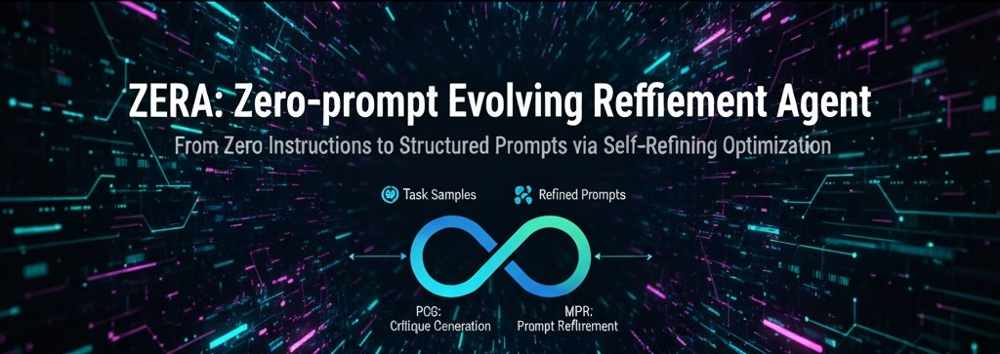

<div align="center">
  
</div>

# Prompt Autotuning Agent Examples

This directory contains various usage examples for the Prompt Autotuning Agent.

## Directory Structure

Each dataset has a separate directory, and each directory contains example code for using that dataset.

- `gsm8k/`: Math problem solving examples
- `mmlu/`: Multiple choice problem solving examples
- `bbh/`: Big-Bench Hard task examples
- `cnn_dailymail/`: News summarization examples
- `mbpp/`: Programming problem solving examples

## Usage

Each example can be executed as follows:

```bash
python examples/<dataset>/example.py
```

Each example provides basic usage along with various options. For detailed information, refer to the comments in each example file.

## Environment Setup

Before running the examples, please verify the following:

1. Check if required packages are installed:
   ```bash
   pip install -r requirements.txt
   ```

2. Ensure `.env` file exists in the project root directory:
   ```
   OPENAI_API_KEY=your_api_key_here
   ```

## Adding New Examples

To add a new example:

1. Create an `example.py` file in the corresponding dataset directory.
2. Add appropriate comments and explanations to the code.
3. Update this README.md file to include information about the new example. 